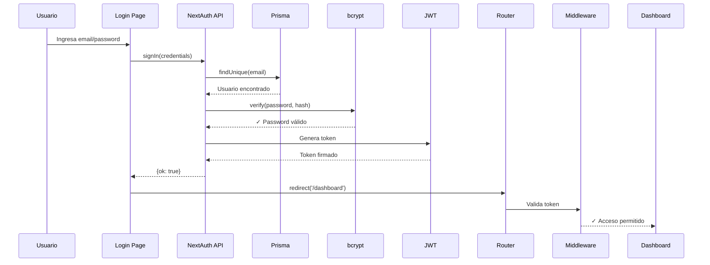
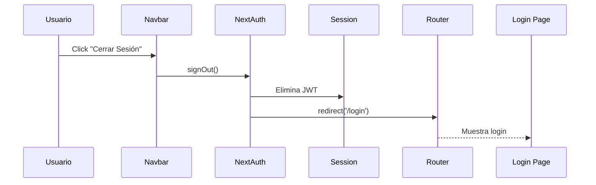

# 🔐 Módulo de Autenticación - PulseTec Control

## 📋 Tabla de Contenidos
1. [Descripción General](#descripción-general)
2. [Tecnologías Utilizadas](#tecnologías-utilizadas)
3. [Arquitectura](#arquitectura)
4. [Componentes Principales](#componentes-principales)
5. [Flujo de Autenticación](#flujo-de-autenticación)
6. [Roles y Permisos](#roles-y-permisos)
7. [Credenciales de Prueba](#credenciales-de-prueba)
8. [Uso y Configuración](#uso-y-configuración)

---

## 📝 Descripción General

Sistema completo de autenticación y autorización basado en **NextAuth.js** con:
- ✅ Login con email y contraseña
- ✅ Sesiones JWT seguras
- ✅ Protección de rutas por roles (RBAC)
- ✅ Logout con redirección
- ✅ UI moderna con diseño PulseTec Control
- ✅ Hashing de contraseñas con bcrypt

---

## 🛠️ Tecnologías Utilizadas

### Backend
- **NextAuth.js v5** - Autenticación completa
- **bcryptjs** - Hash seguro de contraseñas
- **Prisma** - ORM para gestión de usuarios
- **JWT** - Tokens de sesión

### Frontend
- **Next.js 14** App Router
- **React Hooks** (useState, useSession)
- **Tailwind CSS** - Estilos PulseTec

---

## 🏗️ Arquitectura

```
┌─────────────────────────────────────────┐
│          USUARIO (Navegador)            │
└─────────────┬───────────────────────────┘
              │
              ▼
┌─────────────────────────────────────────┐
│       Página de Login (/login)          │
│   - Formulario con validación           │
│   - Manejo de errores                   │
│   - UI PulseTec Control                 │
└─────────────┬───────────────────────────┘
              │
              ▼
┌─────────────────────────────────────────┐
│      NextAuth API Route                 │
│   (/api/auth/[...nextauth])             │
│   - Credentials Provider                │
│   - Verificación de contraseña          │
│   - Generación de JWT                   │
└─────────────┬───────────────────────────┘
              │
              ▼
┌─────────────────────────────────────────┐
│         Middleware (Protección)         │
│   - Validación de token                 │
│   - Verificación de roles               │
│   - Redirecciones                       │
└─────────────┬───────────────────────────┘
              │
              ▼
┌─────────────────────────────────────────┐
│       Rutas Protegidas                  │
│   /dashboard    - ADMIN, DOCENTE        │
│   /docente      - DOCENTE, ADMIN        │
│   /dashboard/usuarios - ADMIN           │
└─────────────────────────────────────────┘
```

---

## 🧩 Componentes Principales

### 1. **Página de Login** (`app/login/page.tsx`)

```typescript
Características:
- Formulario responsive
- Validación en tiempo real
- Mostrar/ocultar contraseña
- Mensajes de error claros
- Loading state
- Diseño PulseTec (gradientes, sombras)
```

### 2. **API de Autenticación** (`app/api/auth/[...nextauth]/route.ts`)

```typescript
Responsabilidades:
- Validar credenciales contra la DB
- Verificar usuario activo
- Comparar contraseñas hasheadas
- Generar JWT con datos del usuario
- Callbacks para sesión y token
```

### 3. **Middleware** (`middleware.ts`)

```typescript
Protección:
- Rutas públicas: /login
- Rutas protegidas: /dashboard/*, /docente/*
- RBAC por roles:
  * ADMIN → acceso total
  * DOCENTE → /docente + /dashboard limitado
  * ALUMNO → solo /dashboard básico
```

### 4. **Navbar con Perfil** (`components/navbar.tsx`)

```typescript
Funcionalidades:
- Muestra email y rol del usuario
- Dropdown con opciones
- Botón de logout
- Datos desde useSession()
```

### 5. **Utilidades de Autenticación** (`lib/auth-utils.ts`)

```typescript
Funciones:
- hashPassword(password) → hash bcrypt
- verifyPassword(password, hash) → boolean
```

---

## 🔄 Flujo de Autenticación

### Login Exitoso



### Logout



---

## 👥 Roles y Permisos

### ADMIN
- ✅ Acceso total al sistema
- ✅ Gestión de usuarios (`/dashboard/usuarios`)
- ✅ Todas las funciones CRUD
- ✅ Portal Docente (como super usuario)

### DOCENTE
- ✅ Portal Docente (`/docente`)
- ✅ Ver sus materias asignadas
- ✅ Pasar lista
- ✅ Calificar tareas
- ✅ Ver alumnos de sus materias
- ❌ NO puede crear usuarios
- ❌ NO puede ver materias de otros docentes

### ALUMNO
- ✅ Dashboard básico
- ✅ Ver sus materias
- ✅ Ver tareas asignadas
- ✅ Entregar tareas
- ❌ NO puede acceder al portal docente
- ❌ NO puede ver datos de otros alumnos

---

## 🔑 Credenciales de Prueba

### Administrador
```
Email: admin@universidad.edu
Contraseña: admin123
Rol: ADMIN
```

### Docente
```
Email: docente@universidad.edu
Contraseña: docente123
Rol: DOCENTE
```

⚠️ **IMPORTANTE:** Cambia estas contraseñas en producción!

---

## 🚀 Uso y Configuración

### 1. Variables de Entorno

Asegúrate de tener en `.env`:

```env
NEXTAUTH_URL="http://localhost:3000"
NEXTAUTH_SECRET="tu-secreto-super-seguro"
DATABASE_URL="file:./dev.db"
```

### 2. Crear Usuarios

```bash
# Crear admin y docente de prueba
npx tsx scripts/create-admin.ts
```

### 3. Iniciar Sesión

1. Ve a `http://localhost:3000/login`
2. Ingresa credenciales
3. Serás redirigido al dashboard

### 4. Proteger Rutas

```typescript
// En cualquier componente
import { useSession } from 'next-auth/react';

export default function MiComponente() {
  const { data: session, status } = useSession();
  
  if (status === 'loading') return <div>Cargando...</div>;
  if (!session) return <div>No autorizado</div>;
  
  return <div>Hola {session.user.email}</div>;
}
```

### 5. Verificar Roles

```typescript
// Server Component
import { getServerSession } from 'next-auth';
import { authOptions } from '@/app/api/auth/[...nextauth]/route';

export default async function AdminPage() {
  const session = await getServerSession(authOptions);
  
  if (session?.user?.role !== 'ADMIN') {
    redirect('/dashboard');
  }
  
  return <div>Panel de Admin</div>;
}
```

---

## 🎨 Diseño PulseTec Control

### Página de Login

- **Fondo:** Gradiente de Dark a Primary
- **Card:** Fondo blanco, sombra 2xl, bordes redondeados
- **Inputs:** Border gray → primary en focus
- **Botón:** Primary con hover dark
- **Logo:** Isotipo PulseTec con sombra animada

### Dropdown de Perfil

- **Card:** Blanca con sombra lg
- **Items:** Hover con fondo light
- **Logout:** Texto rojo con hover red-50
- **Icono:** Avatar circular con primary

---

## 📁 Estructura de Archivos

```
├── app/
│   ├── api/auth/[...nextauth]/
│   │   └── route.ts           # API de NextAuth
│   ├── login/
│   │   └── page.tsx            # Página de login
│   ├── providers.tsx           # SessionProvider
│   └── layout.tsx              # Root con Providers
├── components/
│   ├── navbar.tsx              # Con perfil y logout
│   └── logout-button.tsx       # Botón de cerrar sesión
├── lib/
│   └── auth-utils.ts           # Hash y verify
├── middleware.ts               # Protección de rutas
└── scripts/
    └── create-admin.ts         # Script para crear usuarios
```

---

## 🔒 Seguridad

### Implementado

- ✅ Contraseñas hasheadas con bcrypt (salt 10)
- ✅ JWT firmados con secret
- ✅ Sesiones con expiración (30 días)
- ✅ Verificación de usuario activo
- ✅ Protección CSRF (NextAuth)
- ✅ HttpOnly cookies
- ✅ Middleware de autorización

### Recomendaciones para Producción

- 🔐 Usa HTTPS siempre
- 🔐 Cambia `NEXTAUTH_SECRET` a un valor único y largo
- 🔐 Implementa rate limiting en el login
- 🔐 Agrega autenticación de 2 factores (2FA)
- 🔐 Logs de intentos de login fallidos
- 🔐 Política de contraseñas fuertes
- 🔐 Expiración de sesiones más corta

---

## 📊 Testing

### Probar Login

1. Usuario inactivo → Error "cuenta desactivada"
2. Email inexistente → Error "usuario no encontrado"
3. Contraseña incorrecta → Error "contraseña incorrecta"
4. Credenciales válidas → Redirige a /dashboard

### Probar Protección

1. Sin sesión + /dashboard → Redirige a /login
2. Con sesión + /login → Redirige a /dashboard
3. Rol DOCENTE + /dashboard/usuarios → Redirige a /dashboard
4. Rol ALUMNO + /docente → Redirige a /dashboard

---

## 🎯 Próximos Pasos

- [ ] Recuperación de contraseña
- [ ] Cambio de contraseña desde perfil
- [ ] Autenticación con Google/Microsoft
- [ ] 2FA con código QR
- [ ] Logs de actividad de sesiones
- [ ] Dispositivos activos
- [ ] Forzar logout remoto

---

## 📞 Soporte

Para dudas o problemas con la autenticación:
- Verifica `.env` esté configurado
- Revisa que el usuario esté en la DB
- Confirma que `isActive: true`
- Checa los logs del servidor

---

**Sistema de Autenticación PulseTec Control - 2026** 🚀


